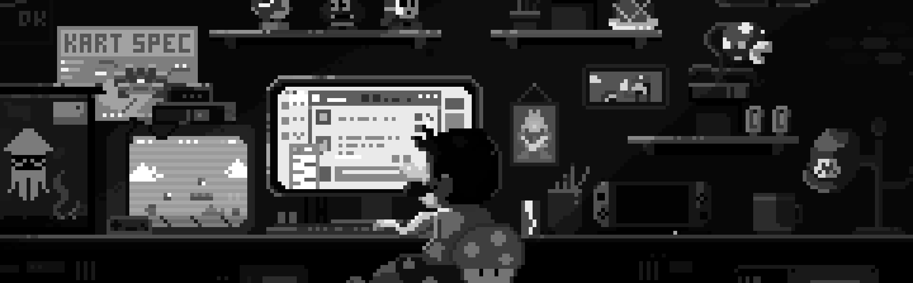

## K E S A V A R A J A

### `AI Systems Engineer` · `Full-Stack Builder` · `Ships Production, Not Prototypes`

  
  
  
  

 

##  About

I build systems that fix themselves before a human notices something broke. My engineering instinct is **brute-force it first, then optimize with data**. I'd rather ship something correct and slow, then profile it into something correct and fast, than guess at premature abstractions.

-  Final-year **AI & Machine Learning** engineer at SRM Institute of Science and Technology, Tiruchirappalli. Graduating May 2027, CGPA 9.11
-  Run a small freelance practice shipping production PWAs and internal tools for real clients, like [PPR Fruits & Vegetables](https://github.com/Kesavaraja67/ppr), not portfolio filler
-  Open-source contributor: 2 merged PRs to [`cxlinux-ai/cx-core`](https://github.com/cxlinux-ai/cx-core) (+1,896 lines, 26/26 tests passing), covering PII redaction and ARG-MAX-safe batching
-  Led a 6-engineer team from zero prior ROS 2 experience to a delivered autonomous campus buggy simulation, on schedule
-  Built for hackathons: Razorpay Pay 2026, Archestra "2 Fast 2 MCP", WeMakeDevs Vision AI, Tambo Generative UI
-  Ask me about: dependency automation, Postgres-backed queues, tree-sitter, generative UI, shipping PWAs to real users

 

##  Currently Building: Telex

**Self-healing dependency infrastructure.** Telex watches package registries, detects breaking releases before they hit production, isolates the affected call sites with `tree-sitter` AST analysis, drafts a patch with an LLM, proves it in a throwaway CI branch, and only then opens a pull request. It never auto-merges. A human reviews every fix.

  

- **3D Repo Atlas:** the codebase graph rendered in `three.js` + `d3-force-3d`, updated incrementally by re-parsing only the files that changed.
- **Patch providers:** pluggable, Claude, Gemini, OpenAI, Groq and Mistral behind one interface.
- **Razorpay edition:** the same engine pointed at failed payments. A two-tier classifier (rules first, LLM second), bounded retries with exponential backoff, and real code defects escalated to verified PRs. 40/40 tests. Built for the Razorpay Pay 2026 Buildathon.

`FastAPI` `async SQLAlchemy` `tree-sitter` `Next.js 15` `GitHub App` `three.js`

  
  
  

> *"Your dependencies just fixed themselves."*

 

##  Tech Stack

<table>
<tr>
<td valign="top" width="50%">

**`Languages`**

<table><tr>
<td align="center" width="88"> Java</td>
<td align="center" width="88"> Python</td>
<td align="center" width="88"> JavaScript</td>
<td align="center" width="88"> TypeScript</td>
</tr><tr>
<td align="center" width="88"> HTML5</td>
<td align="center" width="88"> CSS3</td>
</tr></table>

**`AI / ML & Vision`**

<table><tr>
<td align="center" width="88"> TensorFlow</td>
<td align="center" width="88"> PyTorch</td>
<td align="center" width="88"> OpenCV</td>
<td align="center" width="88"> LangGraph</td>
</tr></table>

**`Data`**

<table><tr>
<td align="center" width="88"> PostgreSQL</td>
<td align="center" width="88"> Supabase</td>
<td align="center" width="88"> Redis</td>
<td align="center" width="88"> MySQL</td>
</tr><tr>
<td align="center" width="88"> MongoDB</td>
</tr></table>

</td>
<td valign="top" width="50%">

**`Frameworks & Runtime`**

<table><tr>
<td align="center" width="88"> React</td>
<td align="center" width="88"> Next.js</td>
<td align="center" width="88"> Spring Boot</td>
<td align="center" width="88"> Flask</td>
</tr><tr>
<td align="center" width="88"> FastAPI</td>
<td align="center" width="88"> Node.js</td>
<td align="center" width="88"> Three.js</td>
<td align="center" width="88"> Electron</td>
</tr></table>

**`Infra & Tools`**

<table><tr>
<td align="center" width="88"> Docker</td>
<td align="center" width="88"> Actions</td>
<td align="center" width="88"> GCP</td>
<td align="center" width="88"> ROS 2</td>
</tr><tr>
<td align="center" width="88"> Git</td>
<td align="center" width="88"> Postman</td>
<td align="center" width="88"> Vercel</td>
</tr></table>

</td>
</tr>
</table>

 

##  Engineering Portfolio

### Flagships

| Project | What it does | Stack | |
| :--- | :--- | :--- | :--- |
| **[Telex](https://github.com/Kesavaraja67/telex)** | Detects breaking npm releases, isolates affected call sites via AST, opens a CI-verified fix PR. 3D repo atlas included | FastAPI, tree-sitter, Next.js, GitHub App |  |
| **[75 Club](https://github.com/Kesavaraja67/75-club)** | Attendance PWA for Indian college students: safe-bunk calculator, AI timetable scanner (Tesseract.js + Gemini), Razorpay Pro plan | Next.js 16, React 19, Supabase |  |
| **[OpusQueue](https://github.com/Kesavaraja67/opus-queue)** | Job scheduler on PostgreSQL only. `SKIP LOCKED` claiming, a reaper for dead workers, cron, retries, dead-letter queue, dashboard | FastAPI, PostgreSQL 16, Next.js | |
| **[Xipper](https://github.com/Kesavaraja67/xipper)** | Local-only codebase packager: 6-layer exclusions, secret scanner (patterns + entropy), LLM digest mode, handles 50k+ files | TypeScript, Electron | |
| **[Genesis Runtime](https://github.com/Kesavaraja67/genesis)** | JSON config in, working full-stack app out. Zod validation, fallback renderers, workflows, OAuth, PWA, ZIP export | Next.js 14, Prisma, PostgreSQL | |
| **LegalMind** *(published, Software Impacts / Elsevier)* | GPU-accelerated RAG pipeline for legal Q&A, served via Triton on Kubernetes | TinyLlama, Triton, Kubernetes | |

### Built under deadline

| Project | What it does | Stack | |
| :--- | :--- | :--- | :--- |
| **[Telex for Razorpay](https://github.com/Kesavaraja67/telex-razorpay)** | Failed-payment recovery: rules-first classifier, LLM fallback, bounded retries, code defects escalated to PRs | FastAPI, Next.js |  |
| **[Semantic Cinematographer](https://github.com/Kesavaraja67/the-semantic-cinematographer)** | Gemini 2.0 Flash reads live video and fires zoom, grading and shake in real time | Next.js 14, FastAPI, Stream Video | |
| **[The Playbook](https://github.com/Kesavaraja67/the-playbook)** | Generative UI where an AI game master reshapes nine canvas components per scenario | Next.js, Tambo AI, Framer Motion |  |
| **[Compliance Sentinel](https://github.com/Kesavaraja67/compliance-sentinel-mcp)** | MCP server screening AI-issued SQL with a regex gatekeeper, PII redaction and an audit log | FastMCP, Python, Next.js | |
| **[FlowCraft](https://github.com/Kesavaraja67/flow-chart)** | HR workflow designer on an infinite canvas with graph validation and step simulation | React, Zustand, Vite |  |
| **[RateLimiter](https://github.com/Kesavaraja67/ratelimiter)** | Sliding-window API limiter on Redis sorted sets, API-key filter, MySQL request history | Spring Boot, Redis, MySQL |  |
| **[srm_buggy_ws](https://github.com/Kesavaraja67/srm_buggy_ws)** | Autonomous electric campus buggy, Phase 1 SITL simulation, led as a 6-person team | ROS 2 Humble, Gazebo | |

<b>More projects</b>

&nbsp;

| Project | What it does | Stack |
| :--- | :--- | :--- |
| **[Cube-Buddy](https://github.com/Kesavaraja67/Cube-Buddy)** | Finds cube colors with OpenCV (HSV), solves with Kociemba, animates the steps | Flask, React, Three.js |
| **[LiveBoard](https://github.com/Kesavaraja67/Infinite-Whiteboard)** | Real-time collaborative whiteboard with rooms ([live](https://infinite-whiteboard.vercel.app)) | React, Socket.io, GSAP |
| **[NextGen Traffic Insights](https://github.com/Kesavaraja67/NextGen-Traffic-Insights)** | Vehicle counting and lane-wise Smooth/Heavy classification | YOLOv8, ByteTrack, OpenCV |
| **[Finance Command Center](https://github.com/Kesavaraja67/finance-command-center)** | Natural-language finance queries where the AI picks the chart | Next.js, Tambo, Recharts |
| **[PPR Fruits & Vegetables](https://github.com/Kesavaraja67/ppr)** | Pre-order PWA for a produce shop in Coimbatore | Next.js, Neon, Gemini |
| **[Echo-Mind](https://github.com/Kesavaraja67/Echo-Mind-Framework)** | Agent with long-term conversational memory | LangGraph, FastAPI, Gemini |
| **[Node Processor](https://github.com/Kesavaraja67/node-processor)** | Parses edge lists, builds trees, detects cycles ([live](https://node-processor.netlify.app)) | Node, React |
| **[AI Job Spec Comparator](https://github.com/Kesavaraja67/AI-Job-Spec-Comparator-XML-to-PDF-Validation)** | Compares XML role definitions to roles extracted from PDFs | Gemini, Pinecone RAG |
| **[Smart Query Translator](https://github.com/Kesavaraja67/Smart-Query-Translator-From-Human-Language-to-SQL)** | Natural language to SQL | Streamlit, LLM |
| **[H.A.R.N.](https://github.com/Kesavaraja67/Plant-Nutrient-Deficiency-Detector-Using-CNN)** | Detects N, P, K deficiency from leaf images | TensorFlow, Streamlit |
| **[Adaptive Voice Tutor](https://github.com/Kesavaraja67/Voice-Based-Tutoring-Assistant)** | Voice tutor prototype for children aged 5 to 10 | PyTorch, Flask |
| **[Water Quality Monitoring](https://github.com/Kesavaraja67/Water-Quality-Monitoring)** | Arduino system reading temperature and TDS | Arduino, C++ |

 

##  GitHub Analytics

 

 

 

##  Let's Build Something

  

*"Learn, Explore, Code, Break, Fix, Sleep, Repeat."*

